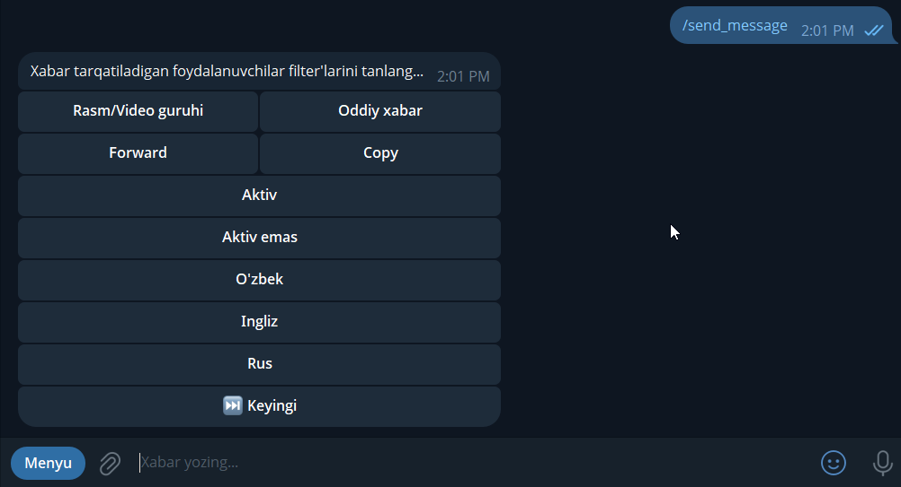
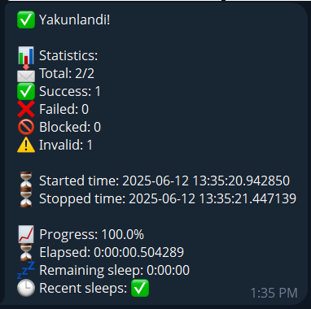
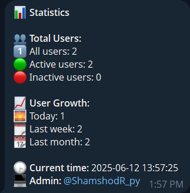
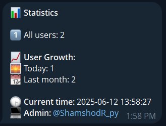
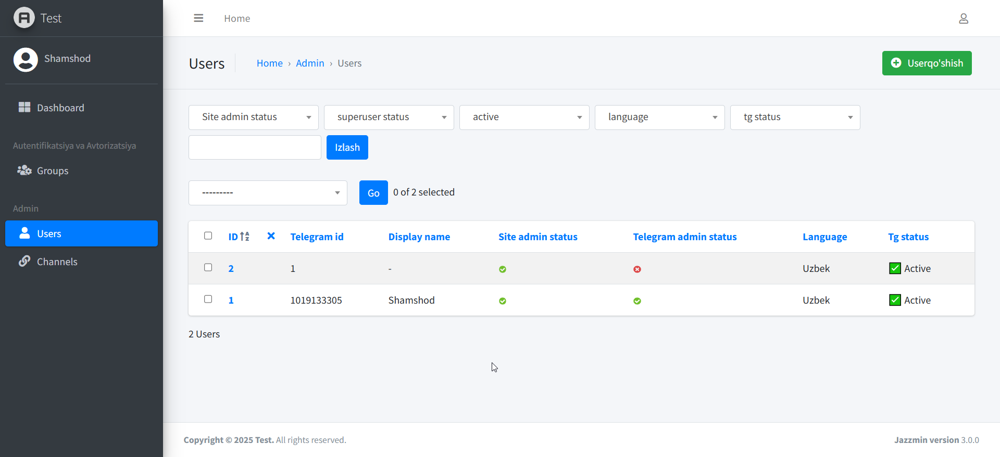
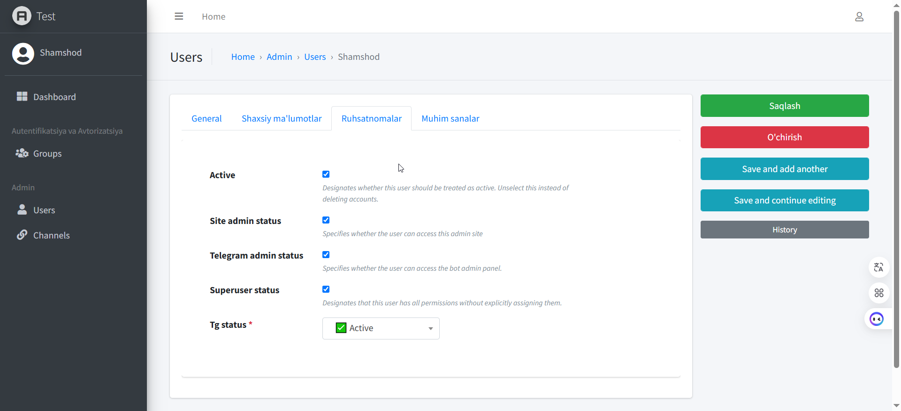
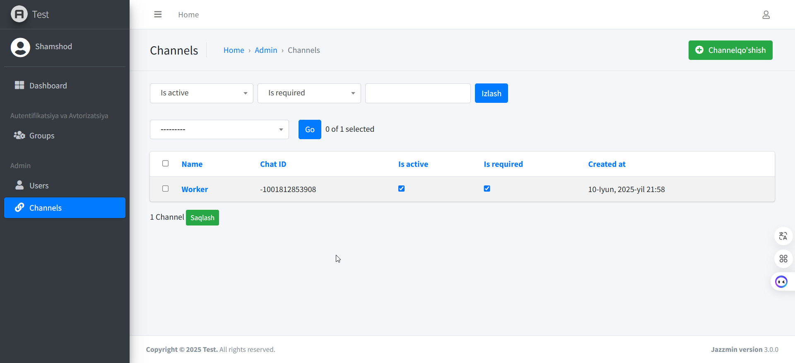
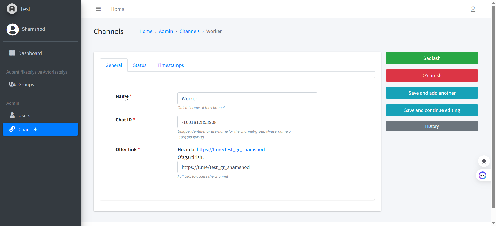
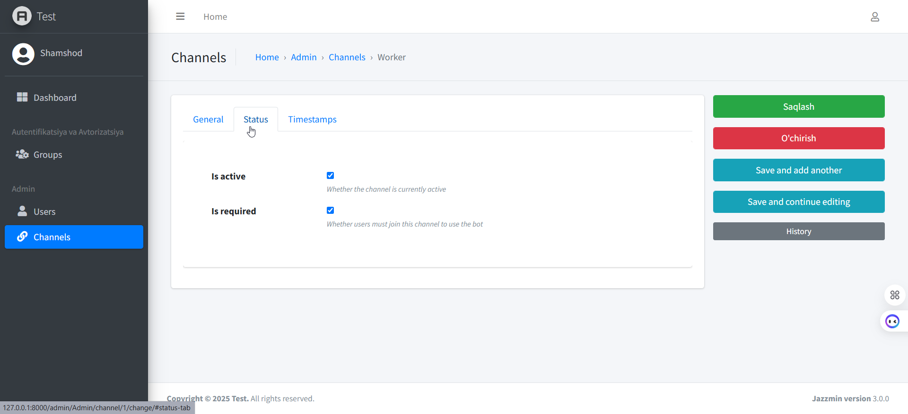
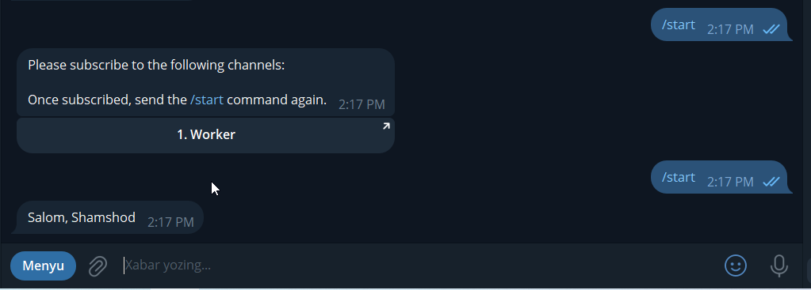

# Aiogram Django Template

## Tavsif
Aiogram Django Template — bu Aiogram va Django yordamida ishlab chiqilgan, admin paneli bor telegram botlari yaratish uchun mo'ljallangan shablon. Loyiha sizga botlarni tezkor ravishda yaratish imkoniyatini beradi.

## Imkoniyatlar
- Aiogram va Django integratsiyasi bilan ishlash.
- Long polling va webhook imkoniyati, DEBUG qiymatiga mos ravishda o'zgaradi.
- Botning majburiy obunalarini boshqarish uchun kengaytirilgan admin panel.
- Foydalanuvchilar sozlamalarini admin panel orqali kengaytirilgan o'zgartirish imkoniyati.
- Media_group, oddiy xabar, forward, copy usullaridan foydalanib foydalanuvchilarga turli filter'larni tanlab xabarlar yuborish imkoniyati.

## O'rnatish
1. Ushbu repositoryni klonlab oling.
2. Tizimda Python 3.11.6 o'rnatilganligini tekshiring. Agar yo'q bo'lsa, o'rnatib oling.
3. `pip install -r requirements.txt` komandasini ishga tushiring loyihani qo'llab-quvvatlovchi paketlar o'rnatilsin.
4. Shablonni o'zingizning loyihangizga moslash uchun kerakli qismlarini o'zgartiring.
5. `python manage.py runserver` komandasi bilan server ishga tushadi.
6. `python manage.py runbot` bilan botni ishga tushiring.

## Foydalanish
Ushbu shablonni o'z telegram botlaringizni yaratish uchun foydalanishingiz mumkin. Kerakli tomonga o'zgartirishingiz kerak. Har doim chaqirib olish imkoniyati mavjud.

## Bot komandalari
1. /statistics - Bot statistics list
2. /send_message - Send message for users

## Xabar yuboriladigan user'lar uchun filter tanlash jarayoni

## Xabar foydalanuvchilarga yetkazilganligi haqidagi statistika

## Adminga ko'rinadigan statistika

## Admin bo'lmagan user'ga ko'rinadigan statistika

## Admin panel

## Majburiy obuna

## Litsenziya

MIT License

Copyright (c) 2025 Shamshod

Permission is hereby granted, free of charge, to any person obtaining a copy
of this software and associated documentation files (the "Software"), to deal
in the Software without restriction, including without limitation the rights
to use, copy, modify, merge, publish, distribute, sublicense, and/or sell
copies of the Software, and to permit persons to whom the Software is
furnished to do so, subject to the following conditions:

The above copyright notice and this permission notice shall be included in all
copies or substantial portions of the Software.

THE SOFTWARE IS PROVIDED "AS IS", WITHOUT WARRANTY OF ANY KIND, EXPRESS OR
IMPLIED, INCLUDING BUT NOT LIMITED TO THE WARRANTIES OF MERCHANTABILITY,
FITNESS FOR A PARTICULAR PURPOSE AND NONINFRINGEMENT. IN NO EVENT SHALL THE
AUTHORS OR COPYRIGHT HOLDERS BE LIABLE FOR ANY CLAIM, DAMAGES OR OTHER
LIABILITY, WHETHER IN AN ACTION OF CONTRACT, TORT OR OTHERWISE, ARISING FROM,
OUT OF OR IN CONNECTION WITH THE SOFTWARE OR THE USE OR OTHER DEALINGS IN THE
SOFTWARE.
